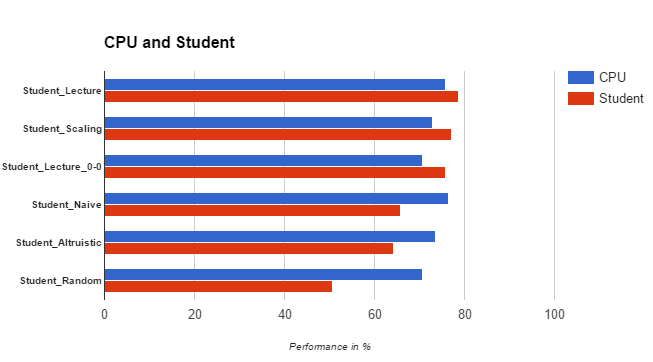

# Overview

The following image illustrates the performance of the different tournament runs.



The following data was used to create the graph.

| Function        | CPU       | Student |
| --------------- |:---------:| :------:|
|Student_Lecture|75.71|78.57|
|Student_Scaling|72.86|77.14|
|Student_Lecture_0-0|70.71|75.71|
|Student_Naive|76.43|65.71|
|Student_Altruistic|73.57|64.29|
|Student_Random|70.71|50.71|

# Comparison of scoring functions

The different custom scoring functions were evaluated and compared against each
other.

## Random scoring function (center)

The player stars at the center when he has the first move.

The first test was done with a scoring function that returned random values for
every node. As expected, the agent performed worse. In the lecture it was
stated, that an _optimal_ agent will always outperform an agent that uses no
strategy or a _non-optimal_ strategy.

```
*************************
 Evaluating: ID_Improved
*************************

Playing Matches:
----------
  Match 1: ID_Improved vs   Random    	Result: 19 to 1
  Match 2: ID_Improved vs   MM_Null   	Result: 15 to 5
  Match 3: ID_Improved vs   MM_Open   	Result: 12 to 8
  Match 4: ID_Improved vs MM_Improved 	Result: 10 to 10
  Match 5: ID_Improved vs   AB_Null   	Result: 18 to 2
  Match 6: ID_Improved vs   AB_Open   	Result: 15 to 5
  Match 7: ID_Improved vs AB_Improved 	Result: 10 to 10


Results:
----------
ID_Improved         70.71%

*************************
   Evaluating: Student
*************************

Playing Matches:
----------
  Match 1:   Student   vs   Random    	Result: 17 to 3
  Match 2:   Student   vs   MM_Null   	Result: 13 to 7
  Match 3:   Student   vs   MM_Open   	Result: 8 to 12
  Match 4:   Student   vs MM_Improved 	Result: 8 to 12
  Match 5:   Student   vs   AB_Null   	Result: 10 to 10
  Match 6:   Student   vs   AB_Open   	Result: 6 to 14
  Match 7:   Student   vs AB_Improved 	Result: 9 to 11


Results:
----------
Student             50.71%
```

## Simple scoring function (center)

The player stars at the center when he has the first move.

This improved scoring function simply returns the number of possible steps at
the given node. As it does not put the opponent into consideration it is not
surprising that the player lost against the computer agent. However, the score
has increased related to the random scoring function, as moves are avoided that
don't offer _many_ next possible steps.

```
*************************
 Evaluating: ID_Improved
*************************

Playing Matches:
----------
  Match 1: ID_Improved vs   Random    	Result: 20 to 0
  Match 2: ID_Improved vs   MM_Null   	Result: 19 to 1
  Match 3: ID_Improved vs   MM_Open   	Result: 13 to 7
  Match 4: ID_Improved vs MM_Improved 	Result: 13 to 7
  Match 5: ID_Improved vs   AB_Null   	Result: 15 to 5
  Match 6: ID_Improved vs   AB_Open   	Result: 15 to 5
  Match 7: ID_Improved vs AB_Improved 	Result: 12 to 8


Results:
----------
ID_Improved         76.43%

*************************
   Evaluating: Student
*************************

Playing Matches:
----------
  Match 1:   Student   vs   Random    	Result: 18 to 2
  Match 2:   Student   vs   MM_Null   	Result: 19 to 1
  Match 3:   Student   vs   MM_Open   	Result: 13 to 7
  Match 4:   Student   vs MM_Improved 	Result: 8 to 12
  Match 5:   Student   vs   AB_Null   	Result: 12 to 8
  Match 6:   Student   vs   AB_Open   	Result: 11 to 9
  Match 7:   Student   vs AB_Improved 	Result: 11 to 9


Results:
----------
Student             65.71%
```

## lecture scoring function (center)

The player stars at the center when he has the first move.

This test used the scoring function from the lecture, where situations that
offer many moves to the opponent are penalized.

```
*************************
 Evaluating: ID_Improved
*************************

Playing Matches:
----------
  Match 1: ID_Improved vs   Random    	Result: 20 to 0
  Match 2: ID_Improved vs   MM_Null   	Result: 18 to 2
  Match 3: ID_Improved vs   MM_Open   	Result: 17 to 3
  Match 4: ID_Improved vs MM_Improved 	Result: 11 to 9
  Match 5: ID_Improved vs   AB_Null   	Result: 17 to 3
  Match 6: ID_Improved vs   AB_Open   	Result: 11 to 9
  Match 7: ID_Improved vs AB_Improved 	Result: 12 to 8


Results:
----------
ID_Improved         75.71%

*************************
   Evaluating: Student
*************************

Playing Matches:
----------
  Match 1:   Student   vs   Random    	Result: 19 to 1
  Match 2:   Student   vs   MM_Null   	Result: 18 to 2
  Match 3:   Student   vs   MM_Open   	Result: 16 to 4
  Match 4:   Student   vs MM_Improved 	Result: 12 to 8
  Match 5:   Student   vs   AB_Null   	Result: 19 to 1
  Match 6:   Student   vs   AB_Open   	Result: 14 to 6
  Match 7:   Student   vs AB_Improved 	Result: 12 to 8


Results:
----------
Student             78.57%
```

## Altruistic scoring function (center)

The player stars at the center when he has the first move.

This scoring function assumes that situations where the enemy has more moves
could lead to a winning situations. The idea was to prefer moves still provide
some space for the opponent. The evaluation shows that this scoring function
performs comparable to the naive scoring function.

```
*************************
 Evaluating: ID_Improved
*************************

Playing Matches:
----------
  Match 1: ID_Improved vs   Random    	Result: 17 to 3
  Match 2: ID_Improved vs   MM_Null   	Result: 20 to 0
  Match 3: ID_Improved vs   MM_Open   	Result: 15 to 5
  Match 4: ID_Improved vs MM_Improved 	Result: 13 to 7
  Match 5: ID_Improved vs   AB_Null   	Result: 16 to 4
  Match 6: ID_Improved vs   AB_Open   	Result: 12 to 8
  Match 7: ID_Improved vs AB_Improved 	Result: 10 to 10


Results:
----------
ID_Improved         73.57%

*************************
   Evaluating: Student
*************************

Playing Matches:
----------
  Match 1:   Student   vs   Random    	Result: 18 to 2
  Match 2:   Student   vs   MM_Null   	Result: 16 to 4
  Match 3:   Student   vs   MM_Open   	Result: 11 to 9
  Match 4:   Student   vs MM_Improved 	Result: 9 to 11
  Match 5:   Student   vs   AB_Null   	Result: 15 to 5
  Match 6:   Student   vs   AB_Open   	Result: 12 to 8
  Match 7:   Student   vs AB_Improved 	Result: 9 to 11


Results:
----------
Student             64.29%
```

## Lecture scoring function (0,0)

The player stars at the coordinate (0,0) when he has the first move.

This test used the scoring function from the lecture, where situations that
offer many moves to the opponent are penalized.

The change of the starting position should evaluate if the starting position
has a major effect or not, as the set of moves in this variant of isolation is
strongly constrained compared to _original isolation_.

The performance was comparable to the scoring function from the lecture, but
performed a little bit worse. This could however be an effect of randomness.

```
*************************
 Evaluating: ID_Improved
*************************

Playing Matches:
----------
  Match 1: ID_Improved vs   Random    	Result: 19 to 1
  Match 2: ID_Improved vs   MM_Null   	Result: 19 to 1
  Match 3: ID_Improved vs   MM_Open   	Result: 11 to 9
  Match 4: ID_Improved vs MM_Improved 	Result: 14 to 6
  Match 5: ID_Improved vs   AB_Null   	Result: 16 to 4
  Match 6: ID_Improved vs   AB_Open   	Result: 11 to 9
  Match 7: ID_Improved vs AB_Improved 	Result: 9 to 11


Results:
----------
ID_Improved         70.71%

*************************
   Evaluating: Student
*************************

Playing Matches:
----------
  Match 1:   Student   vs   Random    	Result: 19 to 1
  Match 2:   Student   vs   MM_Null   	Result: 18 to 2
  Match 3:   Student   vs   MM_Open   	Result: 11 to 9
  Match 4:   Student   vs MM_Improved 	Result: 14 to 6
  Match 5:   Student   vs   AB_Null   	Result: 15 to 5
  Match 6:   Student   vs   AB_Open   	Result: 14 to 6
  Match 7:   Student   vs AB_Improved 	Result: 15 to 5


Results:
----------
Student             75.71%
```

## Scaling scoring function (center)

The player stars at the center when he has the first move.

The idea of this scoring function is to give the opponent more space at the
beginning of the match. Moves that offer more _space_ to the opponent are
penalized more and more while the game progresses. So when we get close to the
end game, the enemy should not get moves _for free_.

The performance of this scoring function was comparable to the scoring function
used in the lecture.

```
*************************
 Evaluating: ID_Improved
*************************

Playing Matches:
----------
  Match 1: ID_Improved vs   Random    	Result: 20 to 0
  Match 2: ID_Improved vs   MM_Null   	Result: 18 to 2
  Match 3: ID_Improved vs   MM_Open   	Result: 14 to 6
  Match 4: ID_Improved vs MM_Improved 	Result: 15 to 5
  Match 5: ID_Improved vs   AB_Null   	Result: 16 to 4
  Match 6: ID_Improved vs   AB_Open   	Result: 11 to 9
  Match 7: ID_Improved vs AB_Improved 	Result: 8 to 12


Results:
----------
ID_Improved         72.86%

*************************
   Evaluating: Student
*************************

Playing Matches:
----------
  Match 1:   Student   vs   Random    	Result: 20 to 0
  Match 2:   Student   vs   MM_Null   	Result: 20 to 0
  Match 3:   Student   vs   MM_Open   	Result: 16 to 4
  Match 4:   Student   vs MM_Improved 	Result: 16 to 4
  Match 5:   Student   vs   AB_Null   	Result: 16 to 4
  Match 6:   Student   vs   AB_Open   	Result: 13 to 7
  Match 7:   Student   vs AB_Improved 	Result: 7 to 13


Results:
----------
Student             77.14%
```